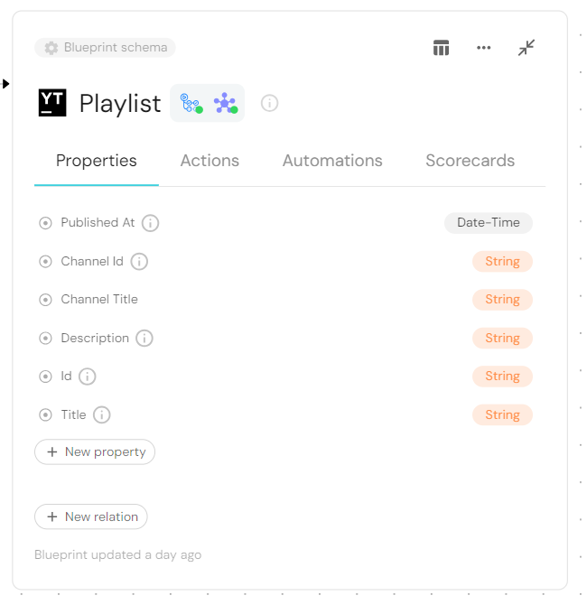
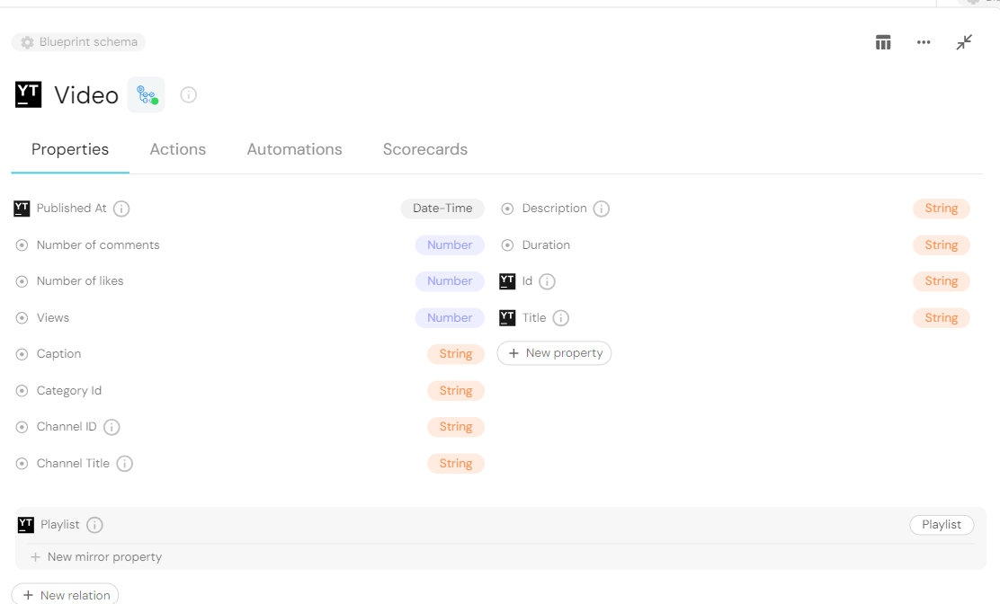
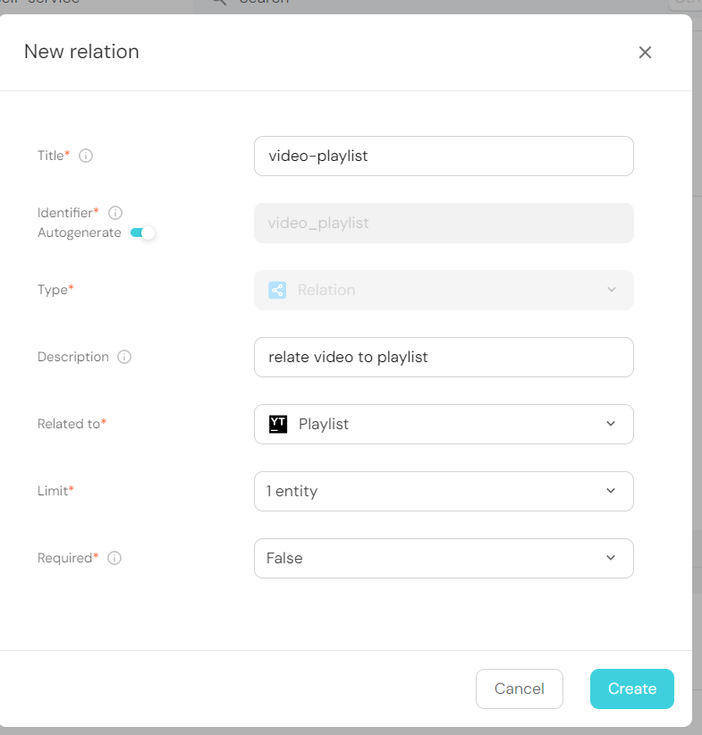
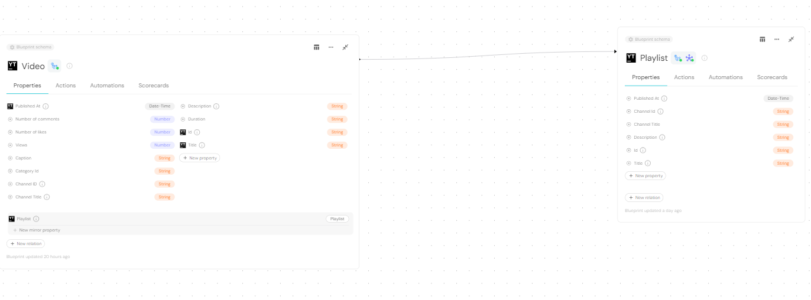
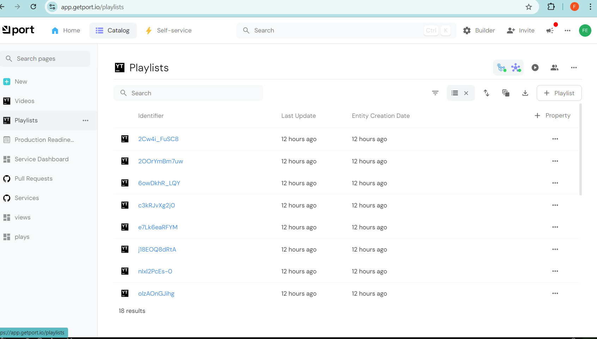
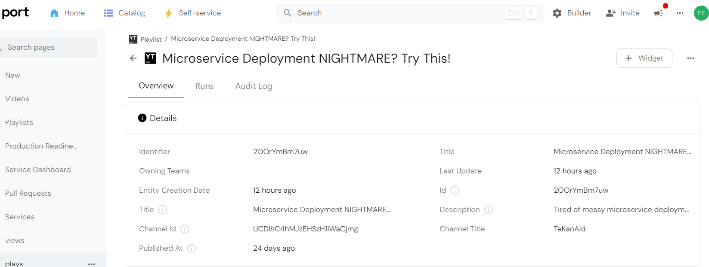
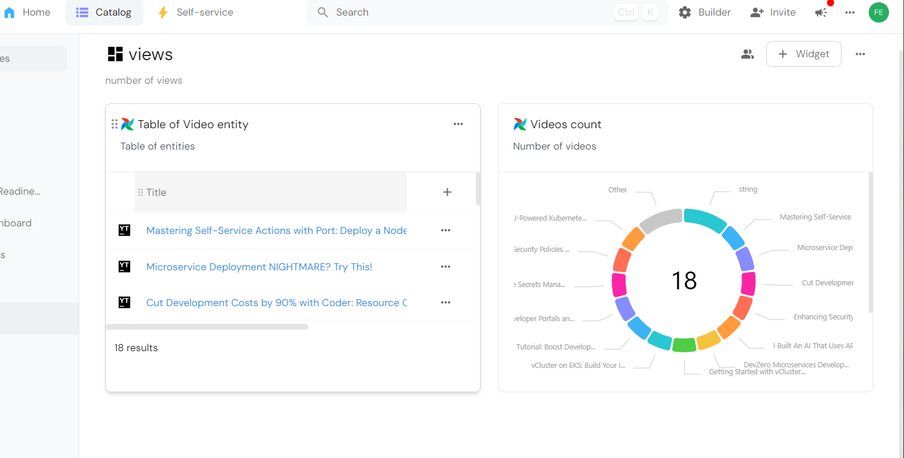

# YouTube Playlist & Videos Catalog in Port

## Introduction
In this guide, I will demonstrate how Port can efficiently manage and visualize data from a YouTube playlist, helping you get insights at a glance. Port is a robust platform for modeling and cataloging diverse data types, and this guide will showcase its capabilities for managing video data.

## Why Use Port?
Port offers a unique approach to data management: Not important
1. **Flexible Data Modeling**: With custom blueprints and properties, you can create a tailored structure to organize various types of data.
2. **Data Ingestion with Automation**: Using GitHub workflows, you can automate the data import process, making it simple to keep your data updated.
3. **Powerful Visualizations**: Port’s visualization tools help you identify patterns, trends, and metrics, making data-driven decisions easier.

## Prerequisites 
1. Port Account. Go to [port website](https://app.getport.io) to create an account 
2. GitHub Account. You should have a GitHub account. After creating a port account there's an onboarding process that helps you integrate GitHub to Port, by installing Port GitHub app.
3. Youtube Playlist.
4. YouTube data API V3. To get this follow the steps below
    1. Log in to [Google Developers Console](https://console.cloud.google.com/apis/dashboard).
    You can log in to Google Developers Console using your Google account. If you don’t have one yet, you’ll need to create one.

     2. Create a new project.
     Once you log in, you’ll automatically be taken to an empty dashboard. On the upper right-hand corner, click Create Project.

     3. You’ll be taken to a screen where you can add a project name, select your organization, and select a location (URL).

     You can create a project without an organization. If you don’t have an organization, you won’t be prompted to select a location.

     Once you create a project, everything you do from here onwards, including creating the API key, will apply to that specific project. If you have multiple projects going at the same time, ensure that the correct one is selected by double-checking that the project is listed on the top navigation bar.

     4. On the new project dashboard, click Explore & Enable APIs.
     After creating a project, you’ll be taken to a brand new dashboard with different cards: Project Info, Resources, and so on.

     Navigate to the Getting Started card and click on Explore & Enable APIs.

     Alternatively, on the sidebar, navigate to APIs & Services > Library.

     5. In the library, navigate to YouTube Data API v3 under YouTube APIs.
     Once you’ve reached the library, you’ll see a page divided into sections. Navigate to the section titled YouTube APIs and select YouTube Data API v3.

     Alternatively, you can search for the YouTube Data API on the search bar.

     6. Enable the API.
     After you arrive at the YouTube Data API page, click a blue button with the word Enable.

     7. Create a credential.
     After clicking Enable, you’ll be taken to an overview page.

     Click on Credentials, Then Create Credentials. Select API Key

    8. A screen will appear with the API key. Copy it. It will be also saved in your credentials for easy retrieval.

## Step 1: Model Data in Port

The first step is to define a model for the YouTube playlist and videos in Port. This involves creating **blueprints** for the playlist and each video, defining their properties, and establishing relationships.

### 1.1. Create Blueprints
- **Playlist Blueprint**: This represents the playlist as a whole.
  - **Properties**:
    - **Playlist ID** (String)
    - **Title** (String)
    - **Description** (String)
    - **Published At** (Date time)
    - **Channel Id** (String)
    - **Channel Title** (String)
    
    
    
- **Video Blueprint**: Each video is an item within the playlist.
  - **Properties**:
    - **Video ID** (String)
    - **Title** (String)
    - **Description** (String)
    - **Published At** (Date time)
    - **Duration** (String)
    - **View Count** (Number)
    - **Channel Id** (String)
    - **Channel Title** (String)
    - **Number of Comments** (Number)
    - **Number of Likes** (Number)
    - **Category Id** (String)
    - **Caption** (Number)
   
    
    


**Example JSON for Playlist Blueprint**:
```json
{
  "blueprint": "Playlist",
  "properties": {
    "Playlist Id": "string",
    "Title": "string",
    "Description": "string",
    "Published At": "datetime",
    "Channel Id": "string",
    "Channel Title": "string"
  }
}
```

**Example JSON for Video Blueprint**:
```json
{
  "blueprint": "Video",
  "properties": {
    "Video Id": "string",
    "Title": "string",
    "Description": "string",
    "Published At": "datetime",
    "Duration": "string",
    "View": "number",
    "Channel Id": "string",
    "Channel Title": "string",
    "Number of Comments": "number",
    "Number of Likes": "number",
    "Category Id": "string",
    "Caption": "string"

  },
  "relationships": {
    "belongs_to": "Playlist"
  }
}
```

### 1.2. Define Relationships
- Link each video to the playlist using a *one-to-many relationship*. This means one playlist blueprint can contain multiple video blueprints.
Click on Video blueprint, then click on New relation
  - On Title, enter any title of your choice
  - On Description, Enter any description
  - On Related to, select Playlist
  - On Limit, select 1 entity
  - On Required, select False
  Then click Create

  

  

## Step 2: Set Up GitHub Workflow

This step involves creating a workflow to fetch data from YouTube and ingest it into Port.

### 2.1 Fetch Data from YouTube
To fetch data, we’ll need to use the YouTube Data API. Here’s how to set up a basic request:

1. **Get API Key**: Register for an API key on the [Google Developer Console](https://console.developers.google.com/). The steps to achieve that is written above on the prerequisites
2. **Fetch Playlist Data**:
   - Use the endpoint `https://www.googleapis.com/youtube/v3/playlists`.
   - Set parameters: `id` (playlist ID), `part` (snippet, contentDetails).

**Example API Call**:
```bash
curl -X GET "https://www.googleapis.com/youtube/v3/playlists?id=YOUR_PLAYLIST_ID&part=snippet,contentDetails&key=YOUR_API_KEY"
```

3. **Fetch Video Data**:
   - Use the endpoint `https://www.googleapis.com/youtube/v3/playlistItems`.
   - Set parameters: `playlistId` (playlist ID), `part` (snippet, contentDetails).

**Example API Call**:
```bash
curl -X GET "https://www.googleapis.com/youtube/v3/playlistItems?playlistId=YOUR_PLAYLIST_ID&part=snippet,contentDetails&key=YOUR_API_KEY"
```

### 2.2 Ingest Data into Port
Once the data is fetched, we'll use Port’s API to upload it.

1. **Format Data in JSON**: Ensure the data matches the blueprint properties defined earlier.
2. **Automate with GitHub Actions**:
   - Write a GitHub Action that runs the fetch and ingest commands.
   Save the following in your GitHub secrets
    - PORT CLIENT ID
    - PORT CLIENT SECRET
    - PORT BLUEPRINT ID(PLAYLIST ID)
    - YOUTUBE API KEY
    - YOUTUBE PLAYLIST ID

   - **Example Workflow**:
     ```yaml
      name: Ingest YouTube Playlist Data to Port using API

      on:
        push:
          branches:
            - main
        workflow_dispatch: 

      jobs:
        fetch-and-ingest:
          runs-on: ubuntu-latest

          steps:
            - name: Check out the repository
              uses: actions/checkout@v2

            - name: Install Dependencies
              run: |
                sudo apt-get update
                sudo apt-get install -y jq

            - name: Fetch YouTube Playlist Data
              env:
                YOUTUBE_API_KEY: ${{ secrets.YOUTUBE_API_KEY }}
                PLAYLIST_ID: ${{ secrets.PLAYLIST_ID }}
              run: |
                # Fetch playlist items (videos) from the YouTube API and save to data.json
                curl -X GET "https://www.googleapis.com/youtube/v3/playlistItems?playlistId=${PLAYLIST_ID}&part=snippet,contentDetails&key=${YOUTUBE_API_KEY}&maxResults=50" > data.json

            - name: Retrieve Port Access Token
              env:
                CLIENT_ID: ${{ secrets.PORT_CLIENT_ID }}
                CLIENT_SECRET: ${{ secrets.PORT_CLIENT_SECRET }}
              run: |
                # Retrieve an access token from Port
                access_token=$(curl --location --request POST 'https://api.getport.io/v1/auth/access_token' \
                  --header 'Content-Type: application/json' \
                  --data-raw '{
                    "clientId": "'"$CLIENT_ID"'",
                    "clientSecret": "'"$CLIENT_SECRET"'"
                  }' | jq '.accessToken' | sed 's/"//g')
                echo "access_token=$access_token" >> $GITHUB_ENV

            - name: Process YouTube Data and Ingest to Port
              env:
                ACCESS_TOKEN: ${{ env.access_token }}
                BLUEPRINT_ID: ${{ secrets.PORT_BLUEPRINT_ID }}
              run: |
                # Parse data.json and extract required fields for each video
                cat data.json | jq -c '.items[] | {
                  identifier: .contentDetails.videoId,
                  title: .snippet.title,
                  properties: {
                    id: .contentDetails.videoId,
                    title: .snippet.title,
                    description: .snippet.description,
                    channel_id: .snippet.channelId,
                    channel_title: .snippet.channelTitle,
                    published_at: .contentDetails.videoPublishedAt
                  }
                }' > processed_data.json

                # Loop through each video entry in processed_data.json and ingest to Port
                while IFS= read -r video; do
                  curl --location --request POST "https://api.getport.io/v1/blueprints/${BLUEPRINT_ID}/entities?upsert=true" \
                    --header "Authorization: Bearer $ACCESS_TOKEN" \
                    --header "Content-Type: application/json" \
                    --data-raw "$video"
                done < processed_data.json

     ```

     

     

## Step 3: Visualize the Data in Port

Port offers tools to visualize data, allowing you to track key metrics like view counts, publishing trends, and playlist growth. Here are two examples of valuable visualizations:

### Visualization 1: Videos count
- **Objective**: Show the number of videos published over time.
- **Usage**: Identify the number of videos added to the playlist.



### Visualization 2: View Count Distribution
- **Objective**: Display the view count of each video to identify popular content.
- **Usage**: Understand which topics or types of content resonate most with viewers.

## Conclusion
With this guide, you now have a blueprint to create a YouTube playlist catalog in Port. By automating data ingestion and using visualizations, Port provides a powerful, centralized solution to manage and understand video data at scale. This approach will save time, ensure data consistency, and provide actionable insights for your audience.

